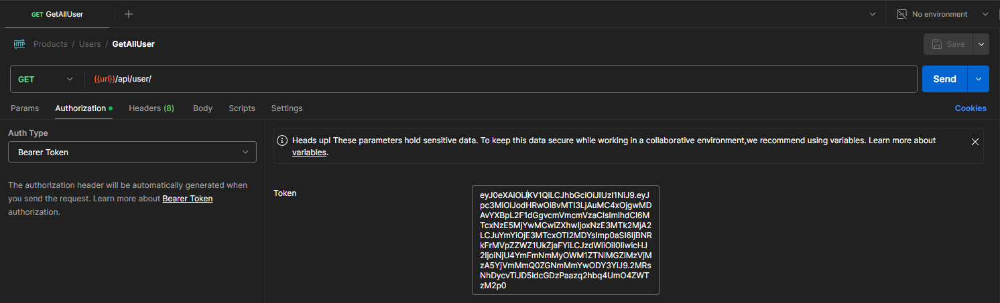

# 🧱 Prueba Arquitecura Hexagonal

# 🚀 Instalación
1. 🛠️ **Instalación Inicial:**

    Asegúrate de tener Composer instalado. Luego, en la raíz del proyecto, ejecuta:

    ```bash
    composer install
    ```
2. 🔄 **Actualizar Dependencias:**

    Para actualizar las dependencias a las versiones especificadas en composer.json, usa:

    ```bash
    composer update
    ```
## 🏁 Ejecución

1. ⚙️ **Configuración del Entorno:**
   
   Para correr el servicio, asegúrate de tener el archivo `.env` configurado como en `.env.example`.

2. ▶️ **Ejecución del Proyecto:**

   Para ejecutar e  l proyecto, utiliza el siguiente comando:
    ```bash
    php artisan serve
    ```

## 📄 Documentación
A continuación se encuentra la documentación de los endpoint pertenecientes a esta API, de igual forma existe un archivo `Products.postman_collection.json` en la raiz del proyecto el cual contiene todo lo mencionado a continuación.

## 🔐 Autenticación
Utilice el [Login](https://github.com/Anvidneo/product-managment?tab=readme-ov-file#-login) para iniciar sesión, una vez logueado utilice el token en el resto de endpoints de la siguiente forma


## 📦 Products

#### 📋 GetAllProduct

- **Method**: GET
- **URL**: `http://127.0.0.1:8000/api/product/`

#### 📋 GetProductById

- **Method**: GET
- **URL**: `http://127.0.0.1:8000/api/product/1`

#### 📋 GetProductByCategoryOrPriceRange

- **Method**: POST
- **URL**: `http://127.0.0.1:8000/api/product/filter`
- **Body**:
    ```json
    {
        "category": 2,
        "minPrice": 0,
        "maxPrice": 150000
    }
    ```
#### 📋 GetListOfPriceByProductsAvalible
- **Method:** POST
- **URL:** `http://127.0.0.1:8000/api/product/list-prices/`

#### ❌ DeleteProduct
- **Method:** DELETE
- **URL:** `http://127.0.0.1:8000/api/product/18`

#### ➕ CreateProduct
- **Method:** POST
- **URL:** `http://127.0.0.1:8000/api/product/`
- **Body:**
    ```json
    {
        "name": "Producto 23",
        "price": 150000,
        "stock": 15,
        "categories": [1, 2, 3]
    }
    ```
#### 🔄 UpdateProduct
- **Method:** PUT
- **URL:** http://127.0.0.1:8000/api/product/31
- **Body:**
    ```json
    {
        "name": "Producto 21 :D",
        "price": 150000,
        "stock": 200,
        "categories": [1, 2, 3]
    }
    ```

## 🏷️ Categories

#### 📋 GetAllCategory
- **Method:** GET
- **URL:** http://127.0.0.1:8000/api/category/

#### 📋 GetCategoryById
- **Method:** GET
- **URL:** http://127.0.0.1:8000/api/category/1

#### ❌ DeleteCategory
- **Method:** DELETE
- **URL:** http://127.0.0.1:8000/api/category/3

#### ➕ CreateCategory
- **Method:** POST
- **URL:** http://127.0.0.1:8000/api/category/
- **Body:**
    ```json
    {
        "name": "Categoria 3"
    }
    ```

#### 🔄 UpdateCategory
- **Method:** PUT
- **URL:** http://127.0.0.1:8000/api/category/1
- **Body:**
    ```json
    {
        "name": "Categoria primera 1"
    }
    ```

## 👥 Users

#### 📋 GetAllUser
- **Method:** GET
- **Authorization:** Bearer Token (token provided)
- **URL:** http://127.0.0.1:8000/api/user/

#### 📋 GetUserById
- **Method:** GET
- **Authorization:** Bearer Token (token provided)
- **URL:** http://127.0.0.1:8000/api/user/4

#### ❌ DeleteUser
- **Method:** DELETE
- **URL:** http://127.0.0.1:8000/api/user/3

#### 🔄 UpdateUser
- **Method:** PUT
- **URL:** http://127.0.0.1:8000/api/user/1
- **Body:**
    ```json
    {
        "name": "juan david",
        "email": "botero@gmail.com",
        "password": "password"
    }
    ```

## 🔑 Auth

#### 🔑 Login
- **Method:** POST
- **URL:** http://127.0.0.1:8000/api/auth/login/
- **Body:**
    form-data
    ```json
    email=botero2@gmail.com
    password=password
    ```

#### 🔒 Logout
- **Method:** POST
- **Authorization:** Bearer Token (token provided)
- **URL:** http://127.0.0.1:8000/api/auth/logout/

#### 🔁 Refresh
- **Method:** POST
- **Authorization:** Bearer Token (token provided)
- **URL:** http://127.0.0.1:8000/api/auth/refresh/

#### 📝 Register
- **Method:** POST
- **URL:** http://127.0.0.1:8000/api/auth/register
- **Body:**
    ```json
    {
        "name": "juan",
        "email": "botero4@gmail.com",
        "password": "password"
    }
    ```

## 📚 Parte Teórica

### Pregunta 1: Definición y Propósito

**¿Qué es la arquitectura hexagonal y cuál es su propósito principal al ser aplicada en un proyecto de Laravel?**

Es un patrón de diseño de software que tiene como objetivo separar el núcleo de la aplicación de las dependencias externas.

### Pregunta 2: Componentes Claves

**Enumera y describe los componentes claves de la arquitectura hexagonal:**

- Núcleo de la aplicación (Casos de uso y entidades)
  
- Interfaces (De entrada y de salida).

- Adaptadores (De entrada y de salida)

### Pregunta 3: Beneficios y Desafíos

**¿Cuáles son los principales beneficios de implementar una arquitectura hexagonal en Laravel?**

-	Independencia de tecnologías, mantenibilidad, testeabilidad y flexibilidad.

**¿Cuáles son algunos de los desafíos que podrías enfrentar al implementarla?**

- •	Complejidad inicial y curva de aprendizaje.

### Pregunta 4: Diferencias con MVC

**Compara la arquitectura hexagonal con la arquitectura MVC tradicional. ¿En qué se diferencian principalmente en términos de estructura y flujo de datos?**

- Una de sus diferencias principales es la estructura, MVC está compuesto por como sus siglas lo indican modelo, vista y controlador, en cambio Hexagonal se centra en la separación del núcleo de la app de las dependencias externas a través de puertos y adaptadores.
